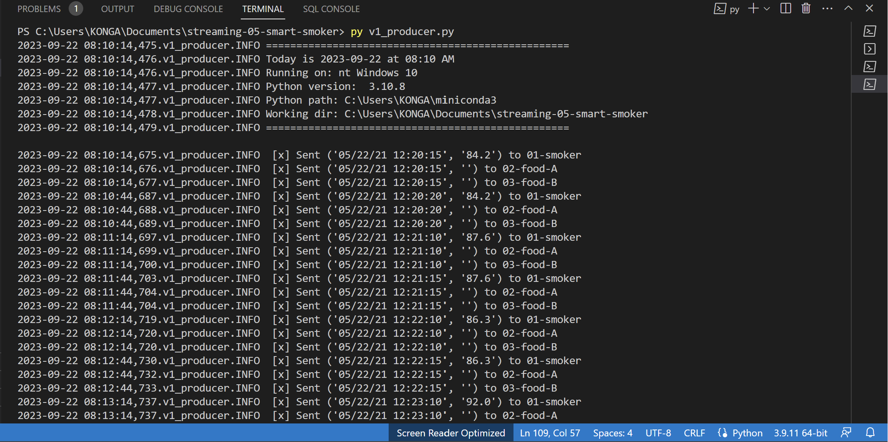
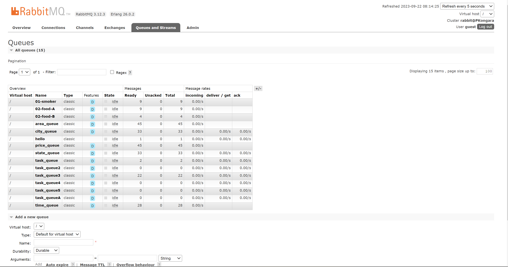

# streaming-05-smart-smoker

Priyanka Gorentla
Created on: 18th September 2023.

Project is about:  
<h6> Smart Smoker </h6> 
Using a Barbeque Smoker  
When running a barbeque smoker, we monitor the temperatures of the smoker and the food to ensure everything turns out tasty. Over long cooks, the following events can happen: 

1. The smoker temperature can suddenly decline.  
2. The food temperature doesn't change. At some point, the food will hit a temperature where moisture evaporates. It will stay close to this temperature for an extended period of time while the moisture evaporates (much like humans sweat to regulate temperature). We say the temperature has stalled.  

We have temperature sensors track temperatures and record them to generate a history of both (a) the smoker and (b) the food over time. These readings are an example of time-series data, and are considered streaming data or data in motion. 

This Project is calling a function to ask the user if they want to see the RabbitMQ admin webpage and calls a function to begin the main work of the program. As part of the main work, we got a connection to RabbitMQ, and a channel, delete the 3 existing queues (we'll likely run this multiple times), and then declare them anew. Open the csv file for reading (with appropriate line endings in case of Windows) and create a csv reader.
For data_row in reader:  
[0] first column is the timestamp - we'll include this with each of the 3 messages below  
[1] Channel1 = Smoker Temp --> send to message queue "01-smoker".  
[2] Channe2 = Food A Temp --> send to message queue "02-food-A".  
[3] Channe3 = Food B Temp --> send to message queue "02-food-B".  
Send a tuple of (timestamp, smoker temp) to the first queue.  
Send a tuple of (timestamp, food A temp) to the second queue.  
Send a tuple of (timestamp, food B temp) to the third queue.  

Terminal output  

RabbitMQ  

